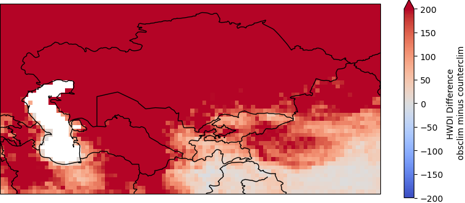
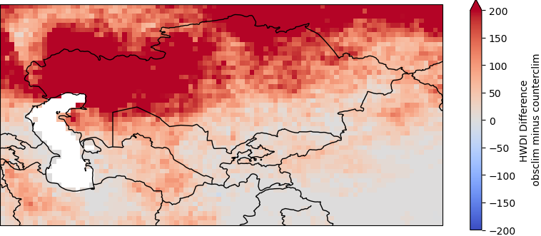
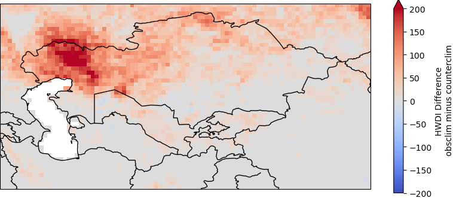
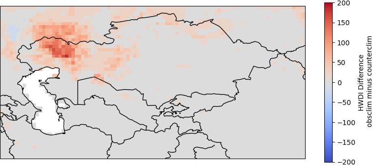

# Heatwave Duration Index (HWDI) Calculation

This repository provides scripts for calculating the Heat Wave Duration Index (HWDI) using the ATTRICIV1.1 dataset, aiming to analyze heatwave occurrences and their intensity.

## Installation

Ensure Python is installed, then set up the environment:

```bash
chmod +x pre_process.sh run_hwmid.sh
```

## Usage
First, preprocess the data:

```bash
./pre_process.sh
```
Run the HWDI calculation script with the slurm on cluster:
```bash
./run_hwmid.sh
```

## Figures

  
*a. HWDI difference map, n day = 5, T = 7K*

  
*b. HWDI difference map, n day = 10, T = 7K*

  
*c. HWDI difference map, n day = 15, T = 7K*

  
*d. HWDI difference map, n day = 20, T = 7K*

*Caption: Heat Wave Duration Index (HWDI) difference maps for varying consecutive days to define a heatwave (n day = 5, 10, 15, 20) and 7K above the reference value (T = 7K).*

## Acknowledgments

Credit to the creators of the ATTRICIV1.1 dataset and all supporting resources.

## Citation
[](https://doi.org/10.5281/zenodo.10723413)
